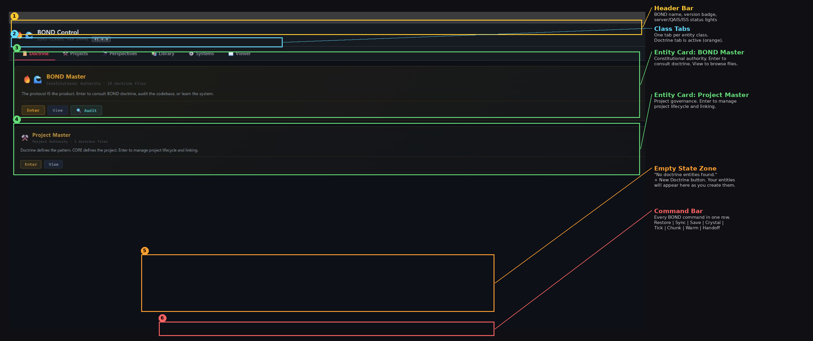
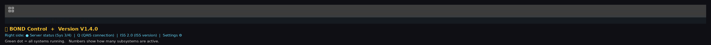
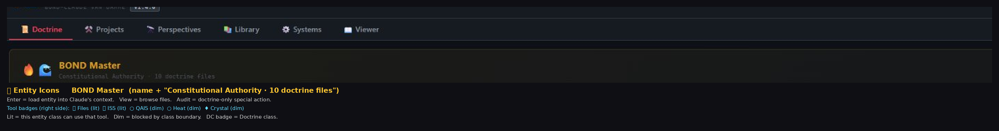
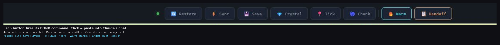
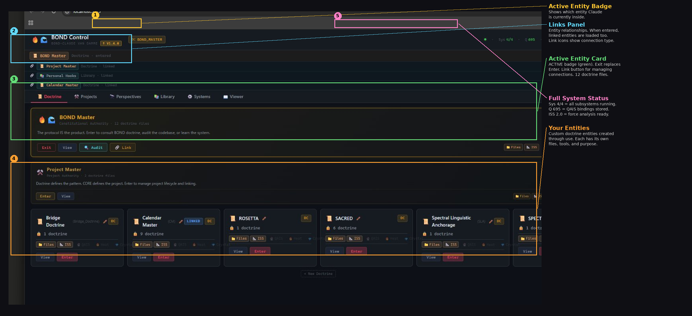
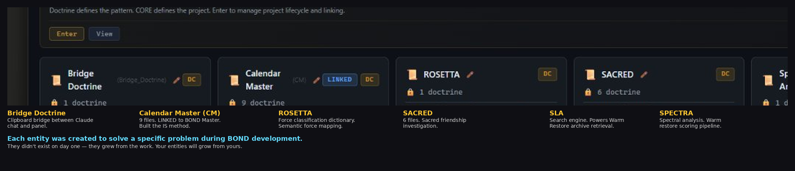

# BOND Panel — Visual Guide

This guide walks you through the BOND Control Panel using annotated screenshots of a fresh install. Every element is labeled so you know what you're looking at before you start using it.

---

## The Panel at a Glance

After installing BOND and running `start_bond.bat`, open `localhost:3000` in your browser. Here's what you'll see:

Six zones, numbered top to bottom:

1. **Header Bar** — BOND name, version badge, and live system status indicators
2. **Class Tabs** — One tab per entity class, plus Viewer
3. **Entity Card** — BOND Master (framework's constitutional authority)
4. **Entity Card** — Project Master (project governance authority)
5. **Empty State Zone** — Where your entities will appear as you create them
6. **Command Bar** — Every BOND command as a clickable button

Let's look at each one.

---

## 1. Header Bar

The header bar runs across the top of the panel.

**Left side:** The BOND fire icon, your instance name ("BOND-CLAUDE VAN DAMME" is the default — yes, it's a joke), and the version badge showing which BOND version you're running.

**Right side:** Live status indicators. The green dot and "Sys 3/4" tell you how many of BOND's four modules are running: EAP (emotion), ISS (semantic forces), Limbic (salience gating), and QAIS (persistent memory). "Q" shows the QAIS binding count — how many identity-role-fact bindings are stored. "ISS 2.0" shows your ISS version. The gear icon opens settings.

If the green dot turns red or the numbers drop, check the Systems tab for details. Most of the time you'll just glance at it to confirm everything's green.

---

## 2. Class Tabs

BOND organizes entities into classes. Each tab shows entities of that class:

**Doctrine** — Framework rules and constitutional documents. This is where BOND Master and your custom doctrine entities live. The active tab is highlighted (orange in the screenshot).

**Projects** — Bounded work with their own CORE.md. Each project gets its own constitution.

**Perspectives** — Unbounded growth entities with seeds and vines. These are the entities that learn and evolve over time.

**Library** — Reference-only entities. Files access only — no QAIS, ISS, or other tools.

**Systems** — Module dashboard. Shows live status of BOND's infrastructure tools (EAP, ISS, Limbic, QAIS) with on/off toggles and stats. Not an entity class — a monitoring view.

**Viewer** — Browse any entity's files without entering it.

On a fresh install, Doctrine is the only tab with content. The others will populate as you create entities.

---

## 3. Entity Cards

Each entity gets a card showing everything you need at a glance.

**Top row:** Entity icons (visual identity), entity name in color, subtitle showing its authority type and file count. Far right: the class badge ("DC" = Doctrine Class).

**Middle:** The entity's description — a one-line summary of what it does and when to enter it.

**Bottom left — Action buttons:**
- **Enter** — Loads this entity into Claude's context. This is how you activate it. Claude reads all its files and applies its class boundaries.
- **View** — Browse the entity's files without entering it. Good for checking what's there.
- **Audit** — Doctrine-only button. Runs a constitutional audit.

**Bottom right — Tool badges:** These show which tools this entity class can access.
- **Lit badges** (bright color) = available. In the screenshot, Files and ISS are lit for doctrine class.
- **Dim badges** (grayed out) = blocked by class boundary. QAIS, Heatmap, and Crystal are dim because doctrine class doesn't get those tools.

Different classes light up different badges. A Project entity would show QAIS, Heatmap, Crystal, and ISS as lit. A Perspective entity would show everything except ISS.

---

## 4. Empty State

The large dark area in the middle of a fresh panel shows "No doctrine entities found" with a `+ New Doctrine` button. This is normal — it means you haven't created any custom entities yet.

The two cards you see (BOND Master and Project Master) are framework entities that ship with every BOND install. They're not yours to modify — they define how the system works. Your entities will appear below them as you create them through the panel or by adding folders with `entity.json` files to the doctrine directory.

---

## 5. Command Bar

The command bar sits at the bottom of the panel. Every BOND command is a button. Click any button and it pastes the corresponding command into Claude's chat window.

**Green dot** (far left) — Server connection indicator. Green = connected and running.

**Core workflow buttons** (dark background):
- **Restore** — Full system reload. Use when starting a new conversation or after losing context.
- **Sync** — Read all active files, run vine lifecycle, reset counter. Your most-used command.
- **Save** — Write proven work to files. Requires both-agree protocol.
- **Crystal** — Crystallize a session insight into QAIS for long-term memory.
- **Tick** — Quick status check. Shows what's active and any obligations.
- **Chunk** — Snapshot the current session state as a conversational summary.

**Session lifecycle buttons** (colored backgrounds):
- **Warm** (orange) — Warm Restore. Picks up context from recent sessions using the SLA search engine with confidence badges.
- **Handoff** (blue) — Draft a session handoff document capturing work, decisions, threads, and files for the next session.

You don't need to memorize what each command does — the button names match the commands exactly, and Claude knows what to do when it receives them.

---

## What Happens Next

After you've looked around the panel, your first real action will be:

1. **Click Sync** — This grounds Claude in your BOND instance. Claude reads SKILL.md, checks what's active, and resets the counter.
2. **Enter BOND Master** — Click the Enter button on the BOND Master card to start exploring the framework's doctrine.
3. **Create your first entity** — When you're ready, use `+ New Doctrine` or create a project through the Projects tab.

For the full walkthrough of your first session, see [GETTING_STARTED.md](../GETTING_STARTED.md).

---

## What a Populated Panel Looks Like

Here's the same panel after months of active use. This is J-Dub's working BOND instance — the one that was used to build BOND itself.

Compare this to the fresh install above. Same six zones, but now the panel is alive:

1. **Active Entity Badge** — The header now shows "DC BOND_MASTER" indicating BOND Master is the currently entered entity. Claude is inside it.
2. **Links Panel** — Below the header, four linked entities are listed. When you Enter an entity, its links load into Claude's context automatically. BOND Master links to Project Master, Personal Hooks, and Calendar Master.
3. **Active Entity Card** — BOND Master's card has changed. The green ACTIVE badge appeared. Enter became Exit. A Link button appeared for managing connections. The file count grew to 12.
4. **Entity Grid** — Six custom doctrine entities fill the space that was empty before. Each was created to solve a specific problem.
5. **System Status** — Sys 4/4 (all four modules running: EAP, ISS, Limbic, QAIS), Q 695 (695 QAIS bindings accumulated over time), ISS 2.0 (semantic force analysis active).

---

## The Entities That Built BOND

None of these existed on day one. Each was created when the work demanded it. J-Dub designed the base architecture for every major system in BOND — the entities and Claude helped refine those designs into working implementations. What you see here is the result of that collaboration.

**Calendar Master (CM)** — 9 doctrine files. The most prolific collaborator in this instance. The IS method — BOND's approach to defining what things ARE by examining semantic force patterns — was J-Dub's invention, originally developed in third grade as a way to internalize calendar knowledge. CM worked with J-Dub to refine that method into BOND's architectural foundation, extending it from personal learning technique to framework doctrine. CM's link to BOND Master (shown by the green LINKED badge) means its files load every time BOND Master is entered. When you see a doctrine entity with a LINKED badge, it means this entity is loaded alongside another entity when that entity is entered — in this case, entering BOND Master also loads CM's files into Claude's context.

**ROSETTA** — Force classification dictionary. When the ISS (Intentional Semantic Separator) was built to analyze semantic forces in text, ROSETTA was created to map those forces to natural language. It translates between mathematical force vectors and human-readable descriptions. A reference tool that other entities consult.

**SACRED** — 6 doctrine files. An investigation into what happens when trust becomes part of a framework — when friendship isn't just context but architecture. This entity explored questions that don't have technical answers, and its findings informed the relationship between trust and framework design.

**SLA (Spectral Linguistic Anchorage)** — The search engine. When sessions started piling up and context needed to be retrieved across conversations, SLA was built to power Warm Restore. It searches archived handoffs and returns results with confidence badges so you know how much to trust what it found.

**SPECTRA** — The scoring pipeline behind Warm Restore. When SLA finds candidate sessions, SPECTRA analyzes them spectrally — scoring relevance, recency, and entity alignment. It writes the badged output that Claude reads back to you during a Warm Restore.

**Bridge Doctrine** — Governed how data crosses the boundary between Claude's chat and the panel. When BOND needed clipboard operations (like pasting commands or copying handoffs), Bridge Doctrine defined the rules. A focused, single-purpose entity that did its job and stayed small.

The point isn't the specific entities — it's the pattern. Each one started as a need, became a folder with an `entity.json`, grew files as work happened, and some linked to others when relationships formed. Your entities will follow the same pattern, solving your problems instead of these.

---

*"Don't just fix the problem — show the owner where their shutoffs are."*
*— ROOT-transfer-knowledge, P11-The Plumber*
